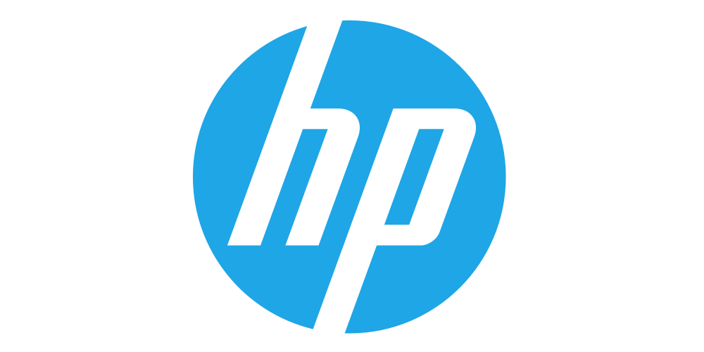

# Mako Core SDK
We believe strongly that the Mako Core SDK is both powerful while extremely easy to use. Just want to convert a document? All it takes is a few lines (fewer still if you have a wide screen monitor). Looking for more complex use cases such as overprint or color management? It's all here.

We also have public projects such as our IPP Printer.

# What can you do with Mako?
Mako is the premium document, printing and page description language (PDL) SDK of choice.

Our SDK has been used extensively across multiple platforms and clouds, including AWS and Azure, with great success. This includes contanerized workloads and serverless functions. 

We also span multiple areas, including print management, pre-press processing (pre-flighting, etc), document management, conversion, variable data, rendering, proofing and much more. 

Want a little more detail? Take a look at our [developer site](https://documentation.globalgraphics.com/support/mako/mako-core) for some [samples](https://documentation.globalgraphics.com/support/mako/mako-core/samples) and [topics](https://documentation.globalgraphics.com/support/mako/mako-core/knowledge-base).

# What makes us unique?

Our Mako SDK is our pride and joy, and it's built upon a staggering amount of industry experience by some of the best engineers in print.

## Our History
The roots of the company go back to 1986 and to Cambridge (UK), and today the majority of the R&D team is still based near this iconic university city. Mako's engineering has benefitted from our rich history of innovation and market leading products, including the Harlequin and Jaws RIPs.

## We are Industry Leaders 
Global Graphics Software, was the trusted partner to help develop the XPS specification with Microsoft, which is a core part of Windows printing. 

You'll also find us sitting on a number of the PDF working groups, making sure that the PDF format continues to work for everyone, well into the future. 

## Our Features
One of our unique features is a page discription language (PDL) agnoistic document object model (DOM). This means that regardless of your input or output, you can use the same consistent DOM to edit your document. 

Save time and code, and write it once with Mako!

## Trusted

You're also in good company. We've helped some of the biggest companies in the industry with their challenges, with great success.  

  
  
  
  

# Technical details

The Mako SDK supports multiple operating systems, including:

- Windows
- Linux (multiple distributions, including Alpine for AWS)
- Android
- iOS

And multiple languages, including:

- C++ (Natively)
- C#
- Java
- Python

And our support for documentent types, either input or output, is second to none. Including:

- PDF (With many different versions and standards)
- XPS
- OXPS
- PCL5
- PCL/XL
- PostScript

And renderers, both generic and platform specific and hardware accellerated, including:

- Raster, PNG, TIFF, JPEG (Via our powerful internal raster image processor (RIP))
- SVG
- XAML
- Skia (Android)
- Quartz (iOS)

# Where can I get it?
Please speak to [sales](mailto:sales@globalgraphics.com) to get an evaluation version of Mako.

# Documentation
If your wondering how we can support your with your challenges, take a look our extensive developer documentation:

https://documentation.globalgraphics.com/support/mako/mako-core

# Support
Not sure how to use an API, or is something not quite right? As a customer of Mako, we offer first class support from our engineers. Alternatively, feel free to leave a question on StackOverflow, using the [Mako-SDK](https://stackoverflow.com/tags/mako-sdk) tag. Our engineers and product managers monitor the tag and will try to get back to you as soon as we can.

Got a tight deadline? We're ready to help, contact our [sales team](mailto:sales@globalgraphics.com) to see what we can do.

# Next steps
To use Mako commercially, you'll need a license. We pride ourselfs on our simple to understand, no-nonsense licenses. We tend not to limit the usages of our APIs or the number of developers or workstations it can be used on, so you can focus on solving your challenges, rather than battling with licensing.

Sounds good? Give our friendly sales team an [email](mailto:sales@globalgraphics.com) and we'll work out the terms that work best for us both.

